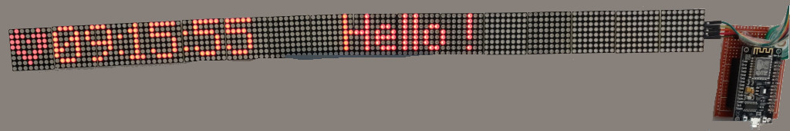

# matrix-connected

Personal project composed of an ESP8266 (NodeMCU) and 16 led matrix (MAX72XX).
His goal is first of all to be a clock. Advanced features are coming along the way.

## Features

- 3 Zones
- Connected to internet (mode Access Point when no Wifi set)
- Clock (use NTP)
- Countdown
- Dynamic message (support french accents)
- Notification (RTTTL sound + Led)
- Heart animation on one matrix

## Routes available

Every parameters are in query string.

- /message/add?msg=XX
- /countdown/stop and /countdown/start?duration=XX (seconds) or /countdown/start?day=XX&hour=XX&minute=XX&second=XX with optionals: noSongAtTheEnd=1 or name=XXX 
- /intensity?val=[0-15]
- /notify/(song|dong|alert)
- /state?state=(on|off) `enable of disable the system`
- /ram `Get the head free space`
- /ram2 `Get the head fragmentation percentage`
- /uptime `Get the uptime`

## Photo

